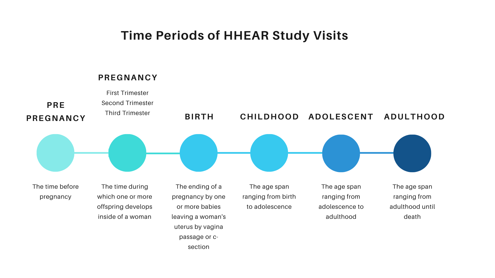
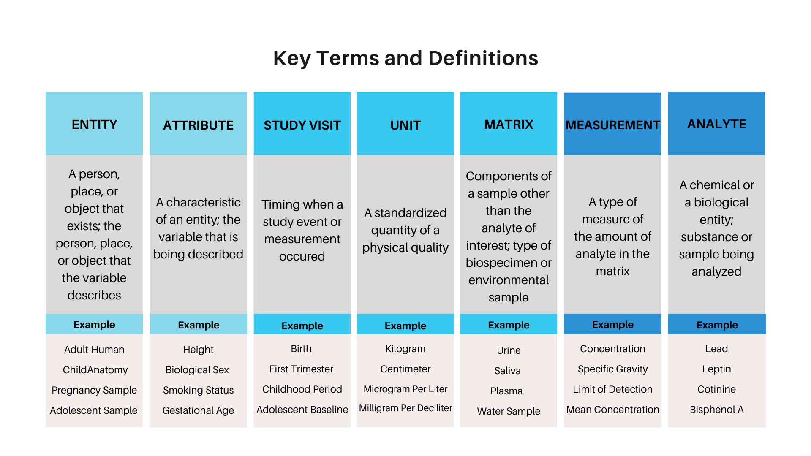

The HHEAR Program includes diverse studies of environmental health across the lifecourse. Compiling and then harmonizing these studies into a single Repository requires the use of common terms and definitions. The following information will help orient you to the terminology used within the repository and the downloads of data you can obtain from the repository.

## Features of HHEAR Data {.tabset}

### Time Periods used within HHEAR

For each study, we map study visits to their lifecourse stage. This enables searching by time-window and pooling studies that collected data during the same life-stage. The image below shows the current time periods represented by HHEAR studies. 

**Note: Longitudinal studies that contain multiple study visits within a single time period are denoted using the terms 'baseline' and 'follow-up'.** 

For example, a study that has 2 study visits within Childhood would use the time periods 'Childhood-Baseline' and 'Childhood-Follow-up'

### Key Terms and Definitions used within the Repository

### Clarification of Ambiguous Terms

We will keep a running list of terms used within the Repository that may not be initially intuitive to users. This list will be updated to correspond to the current release of the repository.

<a href="https://hhear.github.io/pdfs/ambiguous_terms.pdf" target="_blank">TermListing.</a>

